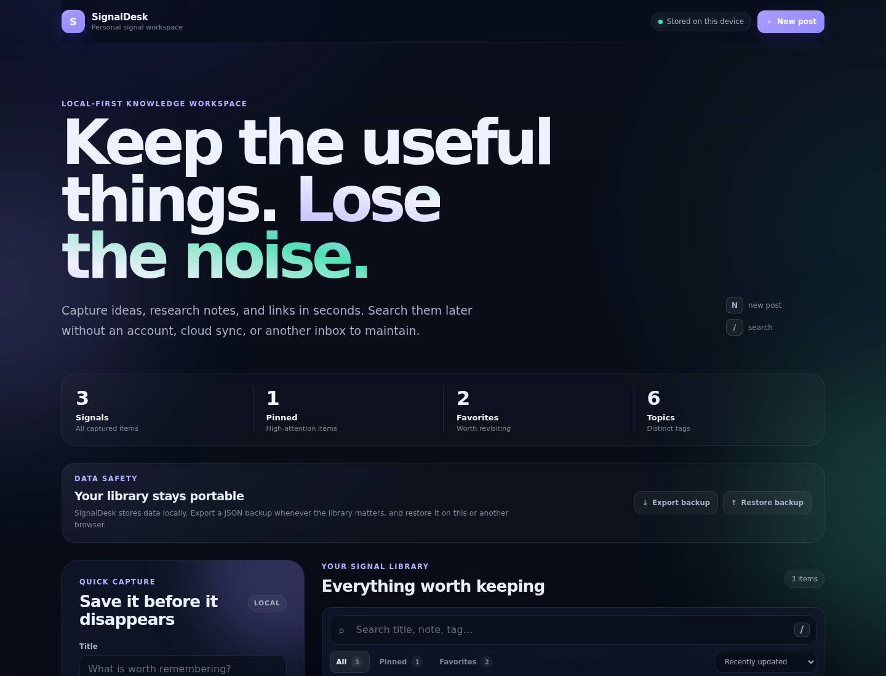
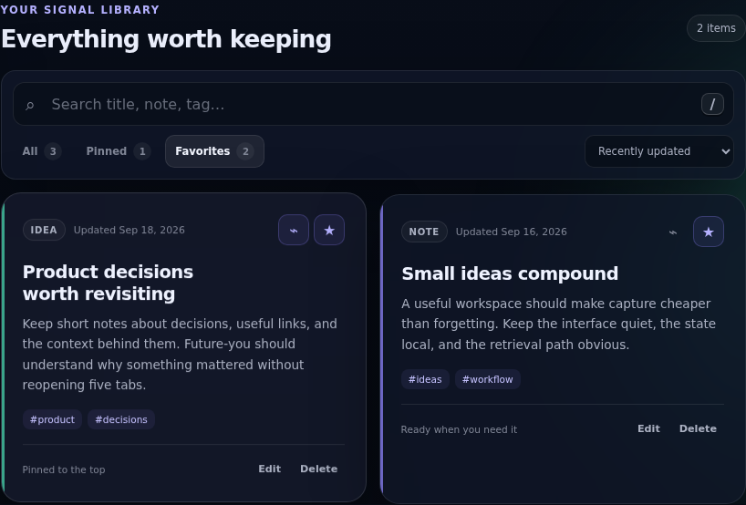
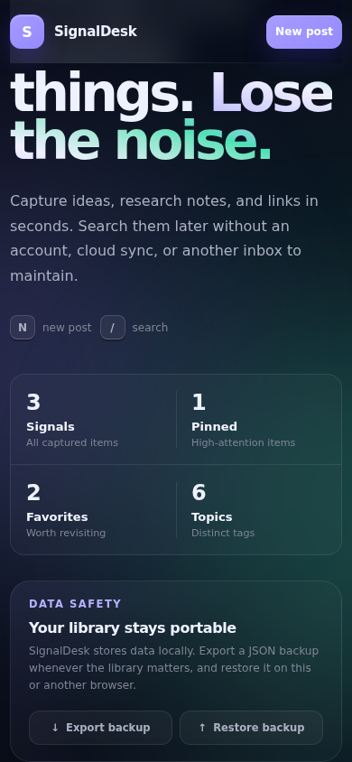

# SignalDesk

### Local-first knowledge workspace for ideas, research notes, and useful sources

[](https://github.com/MykolaDotsenko/Posts-creator-react-app/actions/workflows/quality.yml)


**SignalDesk is a fast, privacy-first React workspace for capturing useful information, organizing it with lightweight structure, and finding it again without another account, backend, analytics layer, or cloud dependency.**

<p align="center">
  
</p>

<p align="center">
  <strong>Capture → organize → retrieve → refine → revisit</strong>
</p>

SignalDesk started as a small React training exercise and was rebuilt into a focused portfolio product with one canonical source of truth, explicit persistence and backup boundaries, accessible interaction states, resilient recovery behavior, and cross-browser automated verification.

## Why this project matters

Most note-taking demos stop at CRUD. SignalDesk focuses on the parts that make a small local tool feel trustworthy:

- useful information is quick to capture
- filtering and retrieval stay predictable
- data survives reloads
- backup and restore are explicit product features
- blocked browser storage is surfaced honestly
- destructive actions have recovery paths
- keyboard and accessibility flows are treated as first-class behavior
- the architecture stays proportional to the product instead of becoming framework-heavy

## At a glance

| Area | Implementation |
| --- | --- |
| **Frontend** | React 19.3 + Vite 8.3 |
| **State** | Reducer-driven canonical post collection + derived selectors |
| **Persistence** | Versioned localStorage adapter |
| **Data safety** | Portable JSON export + validated two-step restore |
| **Accessibility** | Semantic HTML, focus states, reduced motion, forced colors, axe checks |
| **Responsive UI** | CSS Grid/Flexbox, container queries, fluid typography |
| **Browser coverage** | Chromium desktop, mobile Chromium, Firefox smoke, WebKit smoke |
| **Automation** | ESLint, Vitest, Playwright, GitHub Actions |
| **Runtime services** | None required for the core product |

## Product tour

<table>
  <tr>
    <td width="66%">
      
    </td>
    <td width="34%">
      
    </td>
  </tr>
  <tr>
    <td align="center">
      <strong>Focused retrieval</strong><br/>
      Search, sort, pin, and favorite useful signals.
    </td>
    <td align="center">
      <strong>Responsive workflow</strong><br/>
      Capture and backup remain usable on small screens.
    </td>
  </tr>
</table>

## Core capabilities

- create and edit notes, ideas, and source entries
- normalize up to six topic tags per signal
- search across title, body, type, and tags
- pinned and favorite views
- recently updated, newest created, and title sorting
- derived workspace metrics
- one-step Undo after deletion
- versioned local persistence
- portable JSON backup
- validated two-step restore
- explicit session-only warning when browser persistence is unavailable
- corruption-safe storage recovery
- keyboard shortcuts for capture and search
- explicit empty and no-results states
- responsive desktop, tablet, and mobile layouts
- reduced-motion and forced-colors support
- no account, cookies, analytics, or runtime network dependency

## Architecture

```text
React UI
  |
  +--> pure post domain
  |      ├─ normalization
  |      ├─ reducer
  |      ├─ search / filter / sort
  |      └─ derived stats
  |
  +--> storage boundary
  |      └─ versioned localStorage
  |
  +--> backup boundary
         └─ validated JSON export / restore
```

The app keeps a single canonical post collection. Filters and statistics are derived rather than duplicated, persistence is isolated from domain transitions, and backup parsing fails closed before canonical state is replaced.

See [ARCHITECTURE.md](./ARCHITECTURE.md) for design rationale and trade-offs.

## Engineering decisions

### Local-first by design

The core workflow requires no account or backend. User data stays in the browser unless the user explicitly exports a backup.

### Proportional state management

SignalDesk uses React state and a reducer instead of introducing Redux, global context layers, repositories, dependency injection, or backend abstractions that would add more structure than value.

### Explicit failure handling

If localStorage is blocked or unavailable, SignalDesk does not pretend the write succeeded. The UI switches to a session-only warning and suggests exporting a backup.

### Fail-closed restore boundary

Imported backups are validated before state mutation. Invalid JSON, foreign application identifiers, unsupported versions, malformed signals, duplicate IDs, and excessive payloads are rejected.

## Modern UI engineering

- CSS Grid and Flexbox
- container queries
- fluid `clamp()` typography
- `oklch()` and `color-mix()`
- registered CSS custom properties
- backdrop filtering
- progressive visual enhancement
- responsive 2-column → single-column layouts
- reduced-motion support
- forced-colors support

## Quality evidence

The automated suite currently covers:

- **23 unit/domain/storage/backup tests**
- **22 browser checks**
- desktop Chromium
- mobile Chromium
- Firefox smoke
- WebKit smoke
- create → search → edit → delete → Undo
- persistence across reloads
- pinned and favorites filters
- legacy and corrupted storage recovery
- export → clear → restore → reload
- blocked-storage behavior
- intentionally empty-library behavior
- keyboard-first workflows
- axe accessibility checks
- horizontal overflow checks
- production builds and linting in CI

```bash
npm ci
npm run check

npx playwright install chromium firefox webkit
npm run test:e2e
```

## Tech stack

**Runtime**
- React 19.3
- React DOM 19.3
- browser localStorage
- native `crypto.randomUUID()`
- semantic HTML
- modern CSS

**Tooling**
- Vite 8.3
- ESLint 10 flat config
- Vitest 5
- Playwright 1.63
- axe-core
- GitHub Actions

**Deployment**
- Vercel-compatible root build
- GitHub Pages-compatible configurable base path

## Run locally

Requires Node.js 24+.

```bash
npm ci
npm run dev
```

Then open the local Vite URL shown in the terminal.

## Product philosophy

SignalDesk deliberately avoids becoming an “enterprise architecture demo.”

The engineering goal is to keep the implementation understandable while still demonstrating:

- deterministic domain transitions
- one source of truth
- clear browser boundaries
- explicit recovery states
- accessible native controls
- modern visual polish without a UI runtime
- automated evidence that the core workflow still works

**Minimum architectural noise. Maximum useful behavior.**
